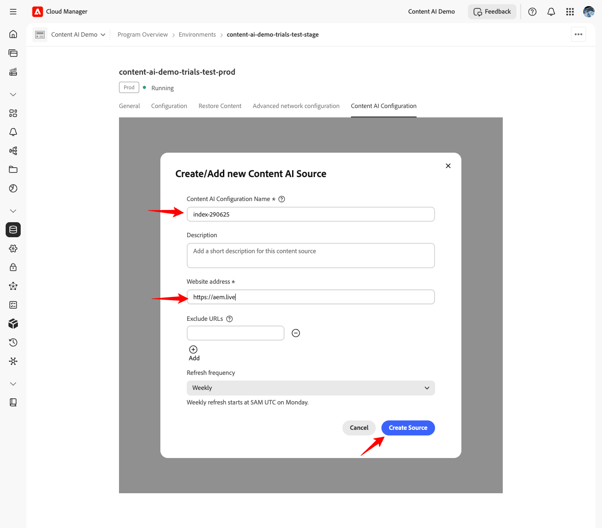
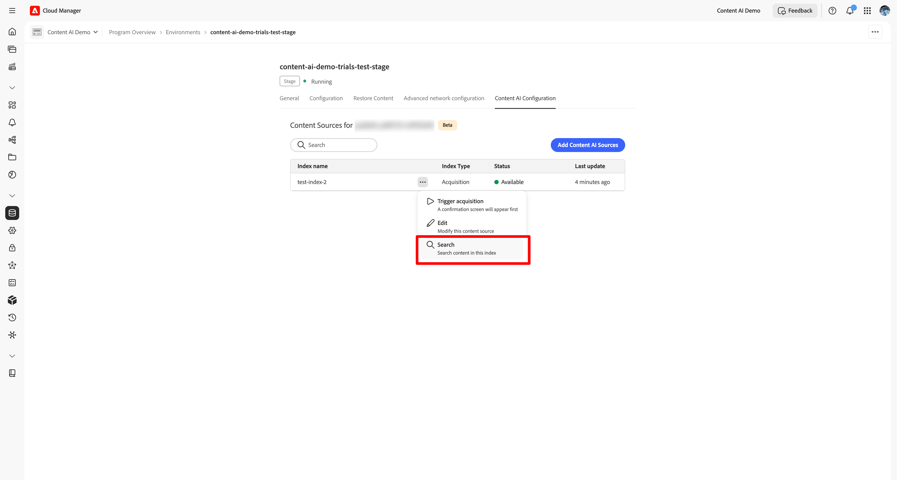
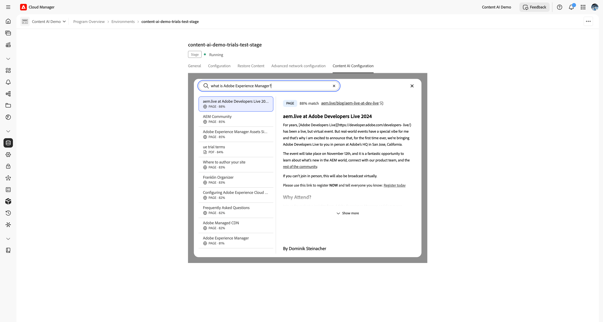

# Set up and manage your Content AI Sources

This guide walks you through setting up Content AI Sources in Cloud Manager - from meeting prerequisites to creating a content source and confirming it is indexed and available.

## Prerequisites {#prerequisites}

Before you begin, ensure the following conditions are met:

- You have an active Cloud Manager program with at least one AEM as a Cloud Service environment.
- You hold the **[System Administrator](https://experienceleague.adobe.com/en/docs/support-resources/adobe-support-tools-guide/adobe-admin-console/admin-roles)** role in Admin Console for the program.
- The environment product profile has been provisioned in **Adobe Admin Console**, see [Set Up an Adobe Developer Console Project](setup-adc-project.md).

## Step 1 - Open the Content AI Configuration Tab {#open-tab}

1. Sign in to [Cloud Manager](https://my.cloudmanager.adobe.com/) and select your program.

   

1. From the **[!UICONTROL Program Overview]**, locate the **[!UICONTROL Environments]** section and select the environment you want to configure.

   

1. On the environment detail page, select the **[!UICONTROL Content AI Configuration]** tab.

   

## Step 2 - Create a Content AI Source {#create-source}

A content source defines the website that Content AI crawls and indexes.

1. On the **[!UICONTROL Content AI Configuration]** tab, select **[!UICONTROL Create Source]**.

   

1. In the **[!UICONTROL Create/Add new Content AI Source]** dialog, fill in the fields:

   | Field | Description |
   | --- | --- |
   | **[!UICONTROL Content AI Configuration Name]** | A unique identifier for this source (for example, `my-site-index`). Cannot be changed after creation. |
   | **[!UICONTROL Description]** | *(Optional)* A short description of the content source. |
   | **[!UICONTROL Website address]** | The root URL of the website to crawl (for example, `https://www.example.com/`). |
   | **[!UICONTROL Exclude URLs]** | *(Optional)* URL patterns to skip during crawling. |
   | **[!UICONTROL Refresh frequency]** | How often Content AI re-crawls the source: Weekly, Daily, Daily 4×, 60 Min, or 15 Min. |

   

   

1. Select **[!UICONTROL Create Source]**.

## Step 3 - Trigger Acquisition {#trigger-acquisition}

After the source is created, its status is **New**. Run an initial acquisition to start indexing.

1. In the source list, select the **more actions** (…) icon next to your source, then select **[!UICONTROL Trigger acquisition]**.

   

1. In the **[!UICONTROL Trigger Acquisition]** dialog, review the source details - **[!UICONTROL Content source]**, **[!UICONTROL Last run]**, and **[!UICONTROL Next scheduled run]** - and select **[!UICONTROL Trigger]**.

   

## Step 4 - Monitor Indexing Status {#monitor-status}

After acquisition starts, the source status updates in real time.

| Status | Meaning |
| --- | --- |
| **New** | Source created; no acquisition has run yet. |
| **Indexing** | Acquisition is in progress; content is being crawled and indexed. |
| **Available** | Indexing is complete; the source is ready to serve search queries. |

Wait for the status to reach **Available** before searching the index or testing the API.

## Step 5 - Search Indexed Content {#search-content}

Once the source status is **Available**, you can run search queries directly from Cloud Manager to verify that content has been indexed correctly.

1. In the source list, select **[!UICONTROL Search]** next to your source.

   

1. Enter a query in the search field. Results show a list of matching items with a match score and content type (for example, **PAGE** or **PDF**). Selecting a result opens a preview on the right.

   

## Modify or Delete a Source {#modify-source}

To update a source configuration after it has been created:

1. In the source list, select the **more actions** (…) icon next to the source, then select **[!UICONTROL Edit]**.

   

1. In the **[!UICONTROL Modify Content AI Source]** dialog, update the **[!UICONTROL Description]**, **[!UICONTROL Website address]**, **[!UICONTROL Exclude URLs]**, or **[!UICONTROL Refresh frequency]** as needed. The **[!UICONTROL Content AI Configuration Name]** is read-only and cannot be changed.

1. Select **[!UICONTROL Save]** to apply the changes, or select **[!UICONTROL Delete]** in the lower-left of the dialog to remove the source entirely.

   >[!WARNING]
   >
   >Deleting a source is permanent. All indexed content for that source is removed and can no longer serve search queries.

   

The source list updates to reflect your changes. If you deleted the source, it no longer appears in the list.

## Next Steps {#next-steps}

- [Set Up an Adobe Developer Console Project](setup-adc-project.md) - Create the ADC project and credentials you need to call the API.
- [Content AI API reference](https://developer.adobe.com/experience-cloud/experience-manager-apis/api/experimental/contentai/) - Query your indexed content using semantic, fulltext, or hybrid search endpoints.

## Troubleshooting {#troubleshooting}

- **Source stays in [!UICONTROL Indexing] for an extended period.** Retry the acquisition from the (…) menu. If the status does not advance after a second run, verify that the **[!UICONTROL Website address]** is publicly reachable and that the **[!UICONTROL Exclude URLs]** patterns do not filter out every page.
- **Source moves back to [!UICONTROL New] after a run.** The crawler could not fetch any pages from the configured root URL. Confirm the URL responds with `200 OK` and that the site is not blocking automated requests.
- **[!UICONTROL Search] returns no results for an [!UICONTROL Available] source.** Indexing succeeded, but no content matched the query. Try a broader query or check that the crawled URLs include the pages you expect.
