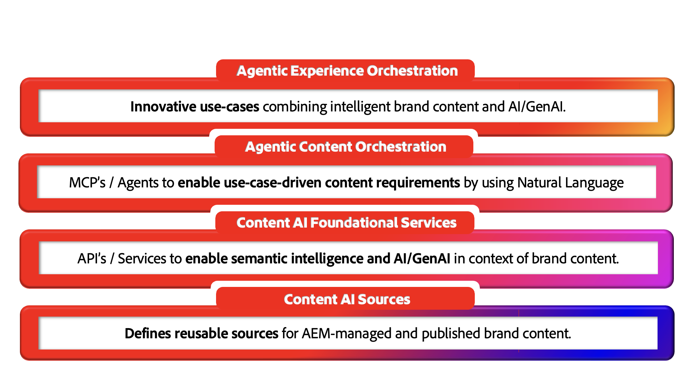

# AEM Content AI - An Introduction

## Intelligent Content, AI-ready by Design {#ai-ready}

Customers are starting to meet brands through AI before they ever meet a website. Chat assistants, AI overviews, agents, conversational search, AI Concierges - all of them retrieve, summarize, and represent brand content on the brand's behalf. What they say is only as accurate, current, and on-brand as the content they can reach.
That is the shift AEM Content AI is built for. It treats brand content as the ground truth that AI experiences run on - and gives AEM customers the tools to create that ground truth faster on the author side and serve it cleanly to consumer-facing AI-driven experiences on the publish side.

**On the author side**, AEM Content AI grounds creation in approved brand sources. AI-assisted authoring, natural-language discovery across existing page content, fragments and assets, and brand-aware generation let teams produce variations for new audiences, regions, and channels without leaving AEM and without drifting from what's already approved.

**On the publish side**, the same content is structured, governed, and addressable for AI to consume. Fragments, metadata, taxonomies, and approved sources are exposed in shapes that retrieval systems, agents, and conversational interfaces can use with confidence - so when AI speaks for the brand, it speaks the brand's truth.

### What it Means for AEM Customers {#what-it-means}

Approved content is the brand's defense against hallucination. When AI is grounded in governed AEM content, answers stay accurate, current, and on-brand by default.
Authoring keeps pace with AI-era demand. Teams generate copy and imagery for more audiences and moments inside the authoring experience - drawing from approved sources rather than starting blank.
Discovery works the way people and machines actually ask. Natural-language, intent-based search across assets, fragments, pages, and forms turns existing content into a reusable supply.
Personalization scales through reuse, not duplication. Governed components recombine into variants instead of multiplying into untracked copies.
Publish channels now include AI surfaces. Content is delivered in shapes that humans, agents, and AI-mediated experiences can all consume - without separate pipelines for each.

**The bigger point: existing trusted brand content is more valuable now than it has ever been. Every approved fragment, asset, and page already living in AEM becomes the ground truth that AI-driven experiences depend on - and AEM Content AI is what makes that library reusable, discoverable, and ready to power what comes next.**

## AEM Content AI at a Glance {#at-a-glance}

AEM Content AI is structured as a four-layer stack - each layer building on the one below, from the trusted content at the foundation to the agentic experiences it powers at the top.

*Read the stack bottom up - from the trusted content at the foundation to the agentic experiences it powers at the top.*

1. Content AI Sources
Content Sources are managed entities in AEM Content AI that connect to a trusted body of content. A Content Source can reference an AEM-governed content type such as assets, content fragments, pages, forms, metadata, and taxonomies, as well as as non-AEM sources such as third-party websites, knowledge bases, or documentation portals. Each Content Source is automatically vectorized and semantically enriched to power retrieval, grounding, and conversational AI experiences. Define Content Sources once and reuse them across Content AI APIs with automatic freshness and updates built in.

1. Content AI Foundational Services
The APIs and services that enable semantic intelligence and generative AI in the context of brand content. Working on top of Content AI Sources, these services power retrieval, generation, brand-aware variation, and optimization - all grounded in the customer's approved content.

1. Agentic Content Orchestration
MCPs and agents that turn use-case-driven content requirements into coordinated action through natural language. This layer lets authors and other agents describe what they need in plain language, and have the right foundational services orchestrated to fulfill it.

1. Agentic Experience Orchestration
The innovative use cases that emerge when intelligent brand content meets AI at scale. AEM solutions themselves are built on these Foundational Services — and customers can use the same APIs directly to build their own agentic experiences over their own content. From AI-powered content supply chains to conversational user journeys, this layer is where governed content becomes a competitive advantage.

These layers are connected by design: every AI service draws from the content foundation, and everything produced flows back into the same governed system - so author-side creation and publish-side delivery share one source of truth.

## AEM Content AI in Action {#action}

Getting to a working Content AI integration involves two tasks:

### 1. Enable Content AI for your AEM Environment {#enable}

**Prerequisite:** Before start using Content AI, you need API credentials scoped to your AEM as a Cloud Service environment. See [Set Up an Adobe Developer Console Project](setup-adc-project.md).

### 2. Control your Content AI Sources {#control}

Set up and manage your Content AI Sources to enable AI-based experiences, see [Control your Content Sources](contentsources.md).

## Get to Know Content AI APIs  {#apis}
 
Explore the functional breadth of AEM Content AI - the APIs showcase the platform's full potential. See [Content AI APIs (2026.04-experimental)](https://developer.adobe.com/experience-cloud/experience-manager-apis/api/experimental/contentai/).
