# Get Started with AEM Content AI

This guide walks you through setting up AEM Content AI in Cloud Manager — from meeting prerequisites to creating a content source and confirming it is indexed and available.

## Prerequisites {#prerequisites}

Before you begin, ensure the following conditions are met:

- You have an active Cloud Manager program with at least one **single-region** AEM as a Cloud Service environment. Multi-region environments are not supported.
- The environment product profile has been provisioned in **Adobe Admin Console**.
- You hold the **Administrator** role in Admin Console for the program.

## Step 1 — Open the Content AI Configuration tab {#open-tab}

1. Sign in to [Cloud Manager](https://my.cloudmanager.adobe.com/) and select your program.

   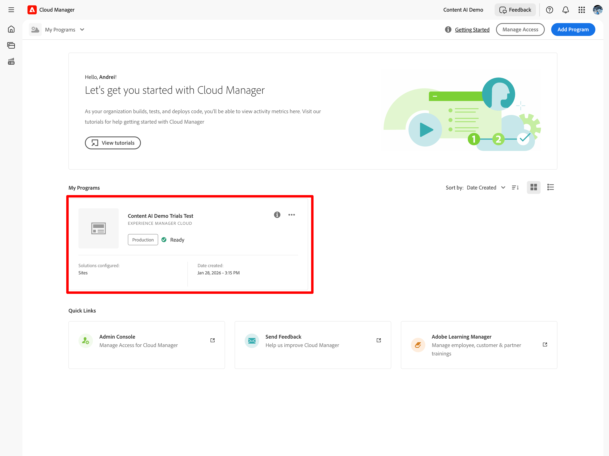

1. From the **Program Overview**, locate the **Environments** section and select the environment you want to configure.

   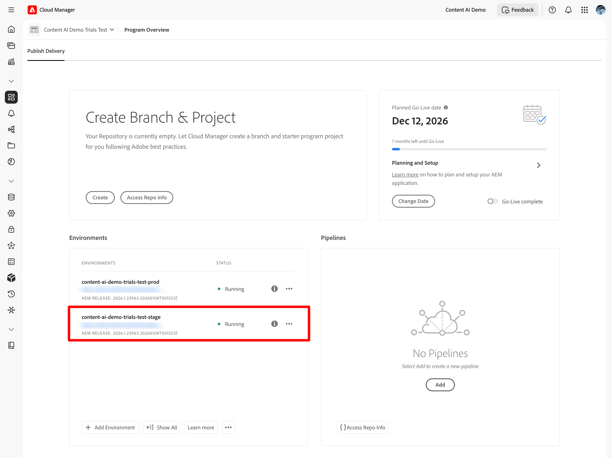

1. On the environment detail page, select the **Content AI Configuration** tab.

   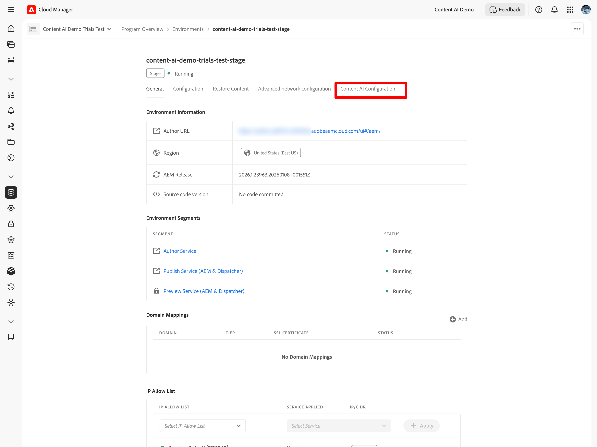

## Step 2 — Create a Content AI source {#create-source}

A content source defines the website that Content AI crawls and indexes.

1. On the **Content AI Configuration** tab, select **Create Source**.

   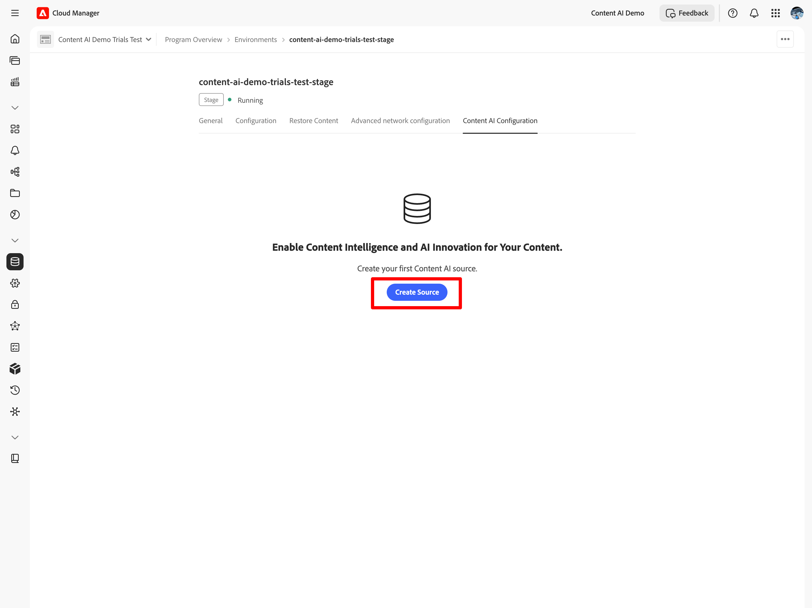

1. In the **Create/Add new Content AI Source** dialog, fill in the required fields:

   | Field | Description |
   | --- | --- |
   | **Content AI Configuration Name** | A unique identifier for this source (for example, `my-site-index`). |
   | **Website address** | The root URL of the website to crawl (for example, `https://www.example.com/`). |
   | **Exclude URLs** | *(Optional)* URL patterns to skip during crawling. |
   | **Refresh frequency** | How often Content AI re-crawls the source: Weekly, Daily, Daily 4×, 60 Min, or 15 Min. |

   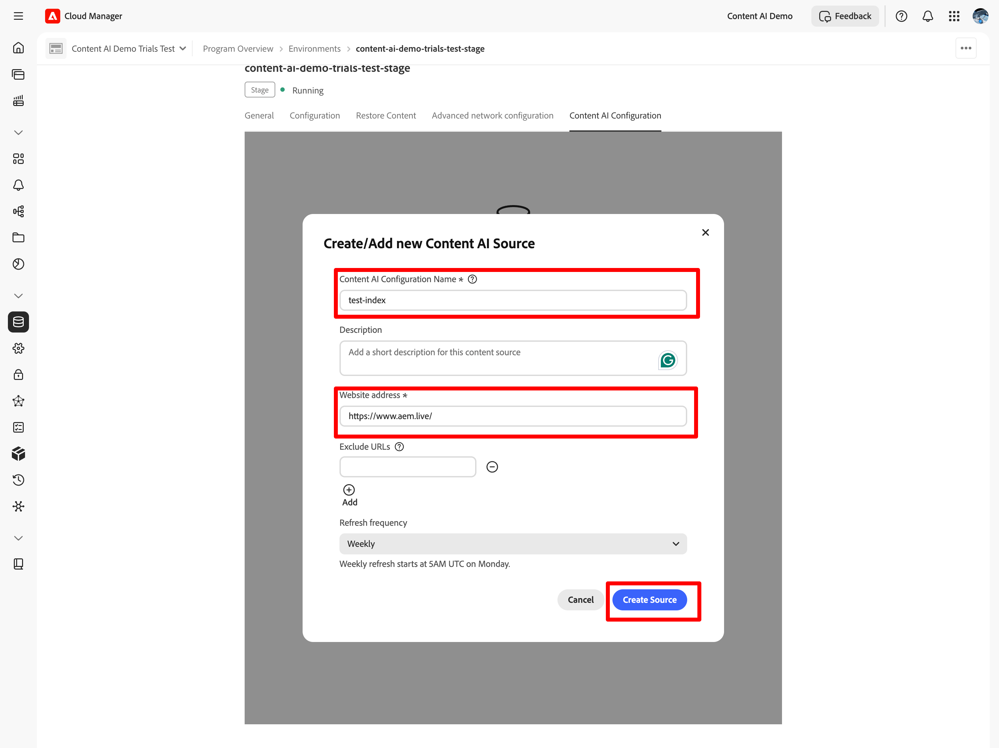

   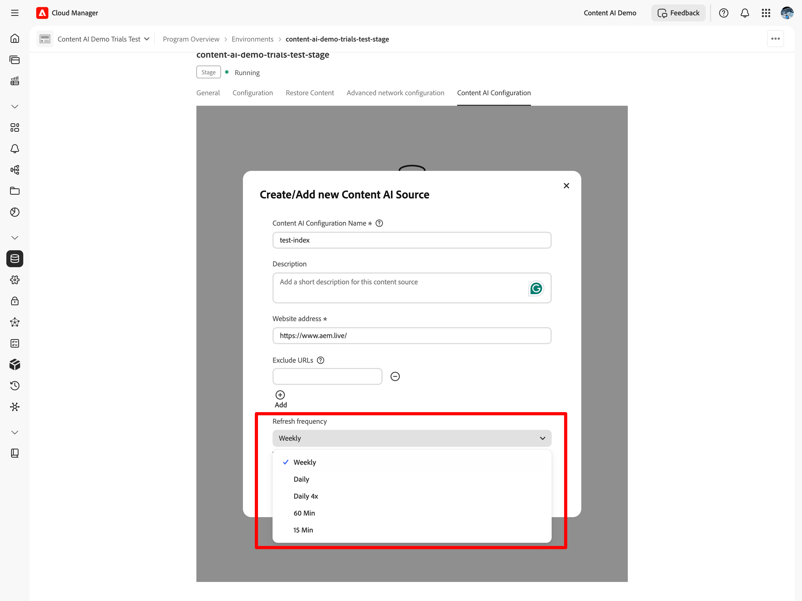

1. Select **Create Source**.

## Step 3 — Trigger acquisition {#trigger-acquisition}

After the source is created, its status is **New**. Run an initial acquisition to start indexing.

1. In the source list, select the **trigger** (▶) icon next to your source.

   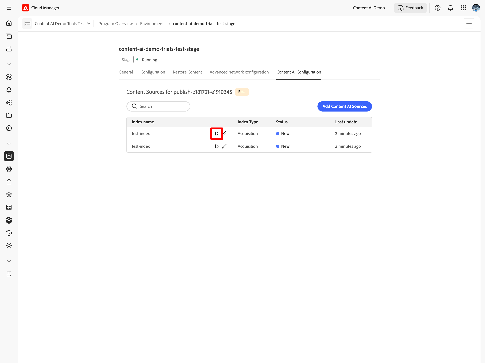

1. In the **Trigger Acquisition** dialog, review the source details and select **Trigger**.

   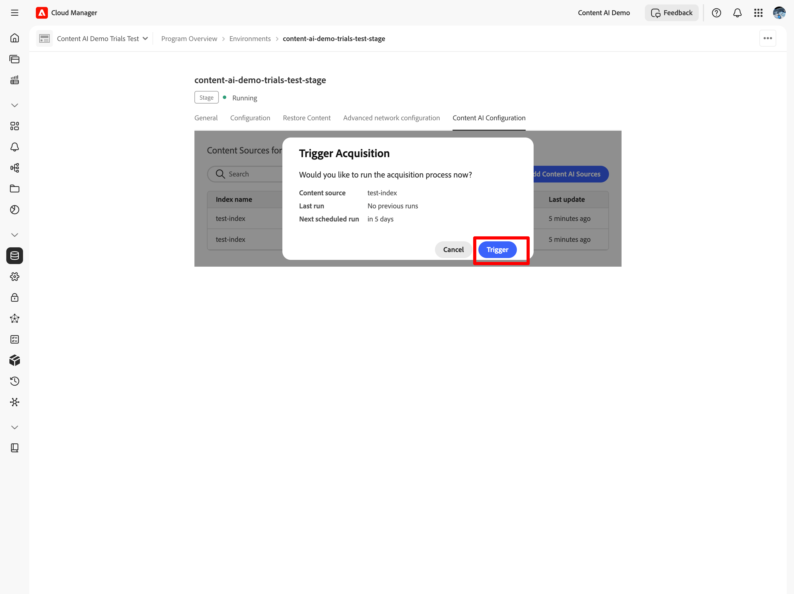

## Step 4 — Monitor indexing status {#monitor-status}

After acquisition starts, the source status updates in real time.

| Status | Meaning |
| --- | --- |
| **New** | Source created; no acquisition has run yet. |
| **Indexing** | Acquisition is in progress; content is being crawled and indexed. |
| **Available** | Indexing is complete; the source is ready to serve search queries. |

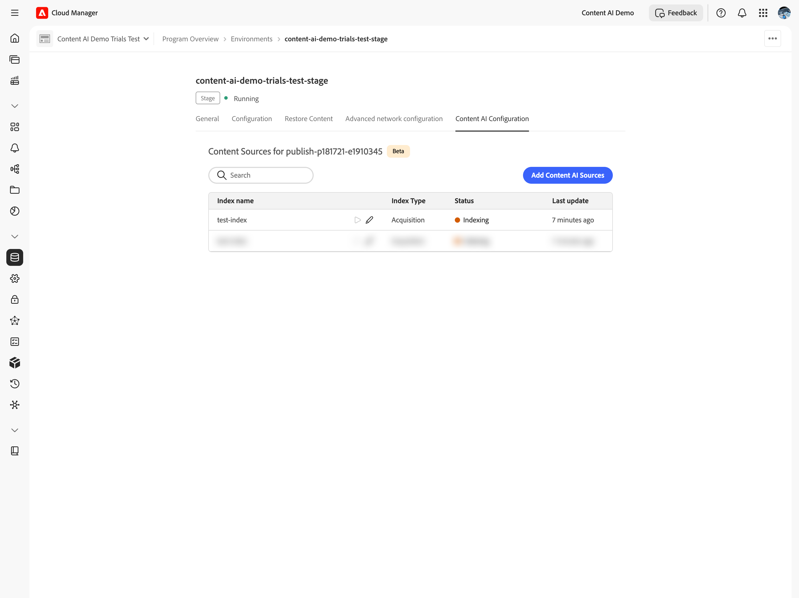

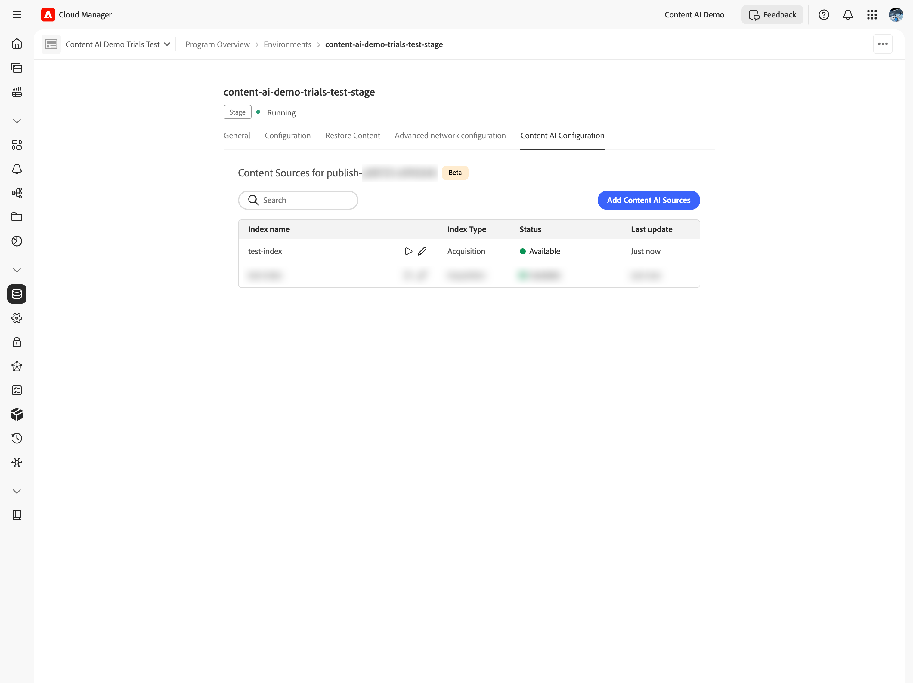

Wait for the status to reach **Available** before testing the API.

## Modify or delete a source {#modify-source}

To update a source configuration after it has been created:

1. In the source list, select the **edit** (✎) icon next to the source.

   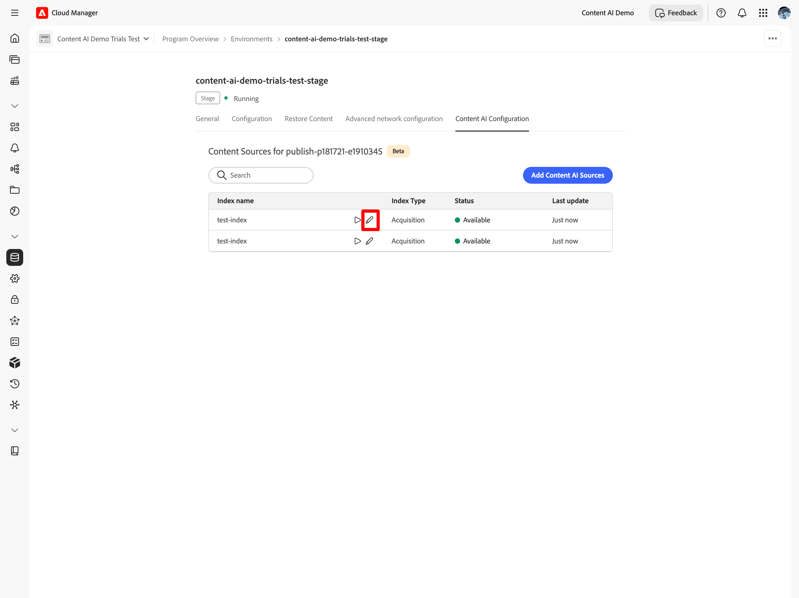

1. In the **Modify Content AI Source** dialog, update the website address, excluded URLs, or refresh frequency as needed.

1. Select **Save** to apply the changes, or **Delete** to remove the source entirely.

   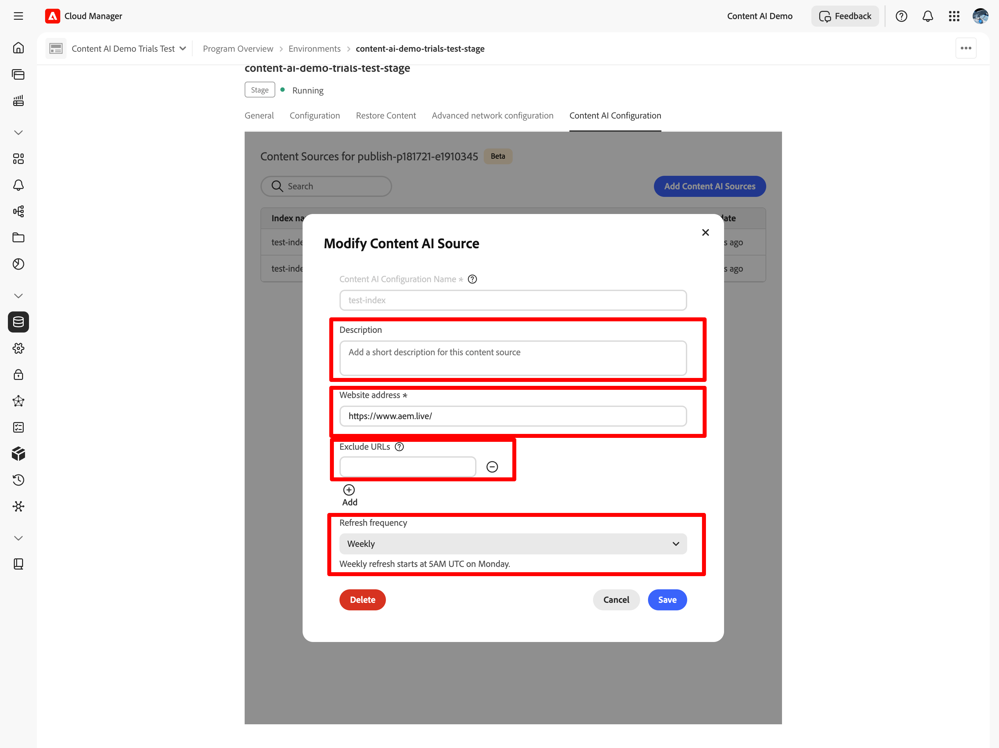

The source list updates to reflect your changes. If you deleted the source, it no longer appears in the list.

## Next steps {#next-steps}

- [AEM Content AI](overview-backup.md) — Learn about semantic search, generative search, and how the indexing pipeline works.
- [Content AI API reference](https://developer.adobe.com/experience-cloud/experience-manager-apis/api/experimental/contentai/) — Query your indexed content using semantic, fulltext, or hybrid search endpoints.
