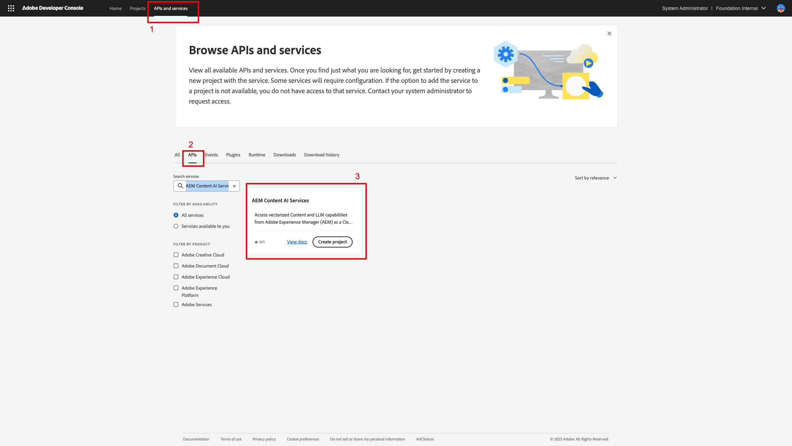
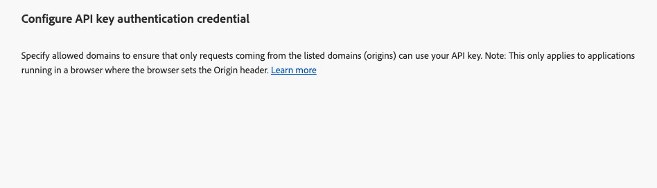

# Set up an Adobe Developer Console Project {#configure-adc-project}

To call the AEM Content AI Services API, you need credentials issued by an Adobe Developer Console (ADC) project. This page walks you through creating the project, selecting an authentication method, and generating the credential you include with every API request.

Go to [Adobe Developer Console](https://developer.adobe.com/console/) for your organization to begin.

## Prerequisites {#prerequisites}

Before you begin, ensure the following:

- You have access to [Adobe Developer Console](https://developer.adobe.com/console/) for your organization.
- You are added as a **Developer** on the AEM Content AI Services product profile in **Adobe Admin Console**. Without this role, the **[!UICONTROL AEM Content AI Services]** API card appears disabled and the **[!UICONTROL Server-to-Server]** authentication option is hidden.
- You know the program and environment numbers for the product profile you want to select (for example, `AEM User - publish - Program 12345 - Environment 67890`).

## Choose an Authentication Method {#choose-auth}

AEM Content AI Services supports two authentication methods. Pick the one that matches your integration:

| Method | Best for |
| --- | --- |
| [Server-to-Server](#s2s-auth) | Backend services that call the API without user interaction. Returns a short-lived access token. |
| [API Key](#api-key-auth) | Client-side or browser-based integrations that call the API directly. Returns a long-lived key scoped to allowed domains. |

## Server-to-Server Authentication {#s2s-auth}

1. Select **[!UICONTROL APIs and services]**, then **[!UICONTROL APIs]**.

   

1. Filter by **AEM Content AI Services**, then select **[!UICONTROL Create Project]** to start a new project, or **[!UICONTROL Add API]** if you are adding the service to an existing project.

   >[!NOTE]
   >
   >If the API card is disabled with a "License required" message, your AEM as a Cloud Service environment may not be modernized. See [Modernization of AEM as a Cloud Service environment](https://experienceleague.adobe.com/en/docs/experience-manager-learn/cloud-service/aem-apis/openapis/setup#modernization-of-aem-as-a-cloud-service-environment).

1. In the **[!UICONTROL Configure API]** dialog, select **[!UICONTROL Server-to-Server]** authentication.

   

   >[!TIP]
   >
   >If the Server-to-Server option is not available, the user setting up the integration is not added as a Developer to the Product Profile. See [Enable Server-to-Server authentication](https://developer.adobe.com/developer-console/docs/guides/authentication/ServerToServerAuthentication/implementation).

1. If needed, rename the credential. Select **[!UICONTROL Next]**.

   

1. Select the **[!UICONTROL AEM User - publish - Program XXX - Environment XXX]** and/or **[!UICONTROL AEM User - author - Program XXX - Environment XXX]** Product Profile, then select **[!UICONTROL Save]**.

   

1. Review the API and authentication configuration.

   

   

### Generate an Access Token {#generate-token}

1. In your ADC project, go to **[!UICONTROL Credentials]** and select **[!UICONTROL Generate access token]**.

   

1. Include the token in the `Authorization` header of every API request:

   ```http
   Authorization: Bearer YOUR_ACCESS_TOKEN
   ```

   >[!WARNING]
   >
   >Store the token securely. It expires and must be regenerated periodically.

## API Key Authentication {#api-key-auth}

1. When adding the AEM Content AI Services API to your project, select **[!UICONTROL API Key]** in the **[!UICONTROL Select authentication type]** dialog.

   

1. Confirm the API Key credential.

   

1. To restrict which origins can use the key, configure allowed domains.

   

1. Your API Key (Client ID) appears under **[!UICONTROL Connected credentials]**. Select **[!UICONTROL Copy]**.

   

1. Include the key in every API request:

   ```http
   x-api-key: YOUR_API_KEY
   ```

   Your project is now ready. Use the key with every request to AEM Content AI Services.

## Next Steps {#next-steps}

- [Control your Content Sources](contentsources.md) - Configure a content source in Cloud Manager and trigger acquisition.
- [Content AI API reference](https://developer.adobe.com/experience-cloud/experience-manager-apis/api/experimental/contentai/) - Use your access token or API key to query the indexed content.
